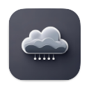

# Nimbus: CloudWatch Log Viewer


A modern, cross-platform desktop application for viewing and analyzing AWS CloudWatch JSON logs with an intuitive interface built on Electron and React.


## Features

With CloudWatch Log Viewer you can:

* **View CloudWatch Logs** using a clean, modern interface designed for developers
* **Search and Filter** logs with powerful query capabilities and natural language date parsing
* **JSON Log Parsing** with syntax highlighting and collapsible tree views
* **Cross-platform** support for macOS, Windows, and Linux

## Get Started

CloudWatch Log Viewer is available for Mac, Windows, and Linux and can be downloaded from the releases page:

**[Download Latest Release](https://github.com/yourusername/cloudwatch-log-viewer/releases)**


### Development Setup

```bash
# Install dependencies
pnpm install

# Start development server with live reload
npm run start
```

## Contributing

We welcome contributions! Please read our contributing guidelines and code of conduct before submitting pull requests.

## License

This project is licensed under the Apache License - see the [LICENSE](LICENSE) file for details.

---

Built with ❤️
